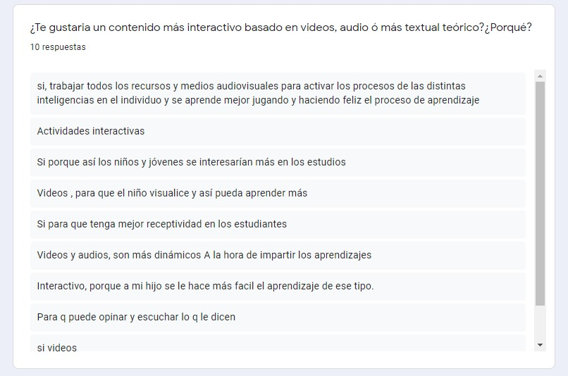

<h1 align="center">Proyecto Social - Network</h1>

## Índice

- [1. Preámbulo](#1-preámbulo)
- [2. Planteamiento del problema](#2-planteamiento-del-problema)
- [3. Resumen del proyecto](#3-resumen-del-proyecto)
- [4. Investigación del PO](#4-investigacion-del-po)
- [5. Test de Usabilidad](#5-test-de-usabilidad)
- [6. Prototipo final](#5-prototipo-final)
- [7. Integrantes](#5-integrantes)

### 1. Preámbulo

Durante el periodo de confinamiento, la tecnología y el uso de las redes sociales han sido los grandes aliados para sentirse cerca de familiares y también de estudiantes y compañeros de trabajo. Esta situación ha supuesto un aumento en el tiempo que han pasado los usuarios en las redes sociales durante 2020, incrementándose en 25 minutos con respecto al año anterior, lo que supone una hora y 20 minutos de uso diario. Sin embargo, a escala mundial los datos no son mejores, ya que cada persona pasa una media de 2 horas y 25 minutos en ellas, tal y como indica We Are Social y Hootsuite.

Referido a estudiantes como espacios de información y comunicación, las redes permiten informarse de lo que ocurre en diferentes partes del mundo, acceder a puntos de vista variados, contactar con estudiantes de todas las áreas y obtener inspiración al instante. Además, estas facilitan el acceso a múltiples medios informativos y por tanto a formar estudiantes con una postura más crítica.

### 2. Planteamiento del problema

### 3. Resumen del proyecto

Construir una Red Social en la que cualquier usuario pueda crear una cuenta de acceso y loguearse con ella; así como crear, editar, borrar y "likear" publicaciones.

Wartay (Fusión de Warma =niño y Watay = educar en quechua) es una red social educativa dirigida a padres, profesores y alumnos del nivel primario, en la cual tendrán la opción de compartir y crear información en diversas áreas de estudio para reforzar el aprendizaje de los estudiantes.

<strong>Wartay</strong>

 
<strong>Logo Red Social Educativa<strong>

### 4. Investigación del PO (Público Objetivo)

> ¿Quiénes son los principales usuarios?

Estudiantes, padres y profesores del nivel de educación primario (primero a sexto grado).

Encuestas realizadas:

> ¿Cuáles son los objetivos de estos usuarios en relación con el producto?

- Estudiantes:

> "Encontrar un espacio dedicado a compartir y encontrar información necesaria para realizar y entender mis tareas."

- Profesores:

> "Compartir un espacio virtual seguro a donde puedan recurrir como apoyo para que puedan solucionar las dudas que tengan."

- Padres:

> "Compartir con los profesores y otros padres a través de una red segura información para poder apoyar a nuestros hijos"

> ¿Cuáles son datos más relevantes que quieren ver en la interfaz y porqué?

> ¿Cuando utilizarían el producto?

Antes y después de clases como refuerzo y guía.

### 5. Test de usabilidad:

Se realizo un test a 5 personas sobre la usabilidad de la red social y su diseño, su feedback fue el siguiente:

### 6. Prototipo Final:

#### Mobile

#### Desktop

### 7. Proyecto Tríos:

- [Ana Fernández](https://github.com/Afernandezc435/ 'Ana Fernández')
- [Erika Gonzalez](https://github.com/erikagonza25/ 'Erika Gonzalez')
- [Kelly Márquez](https://github.com/kelmita22 'Kelly Márquez')